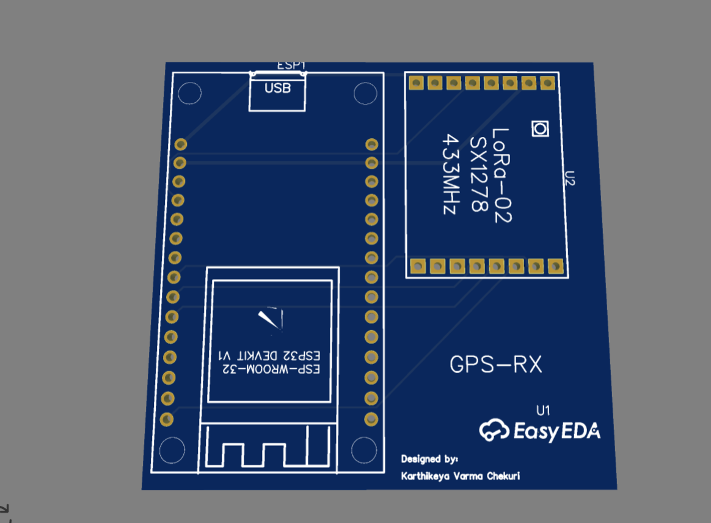
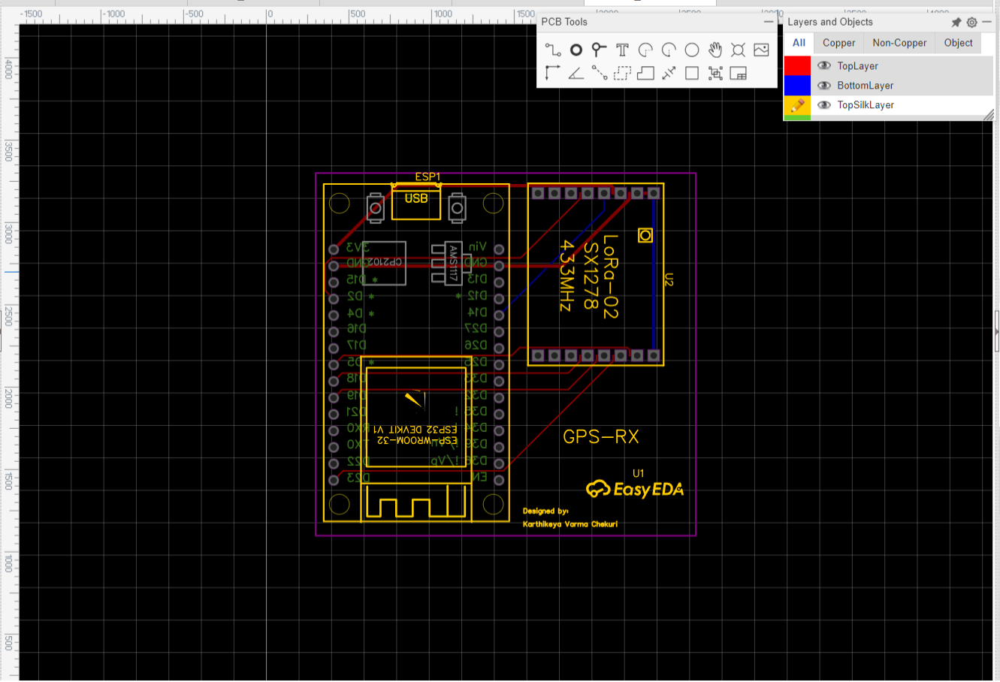
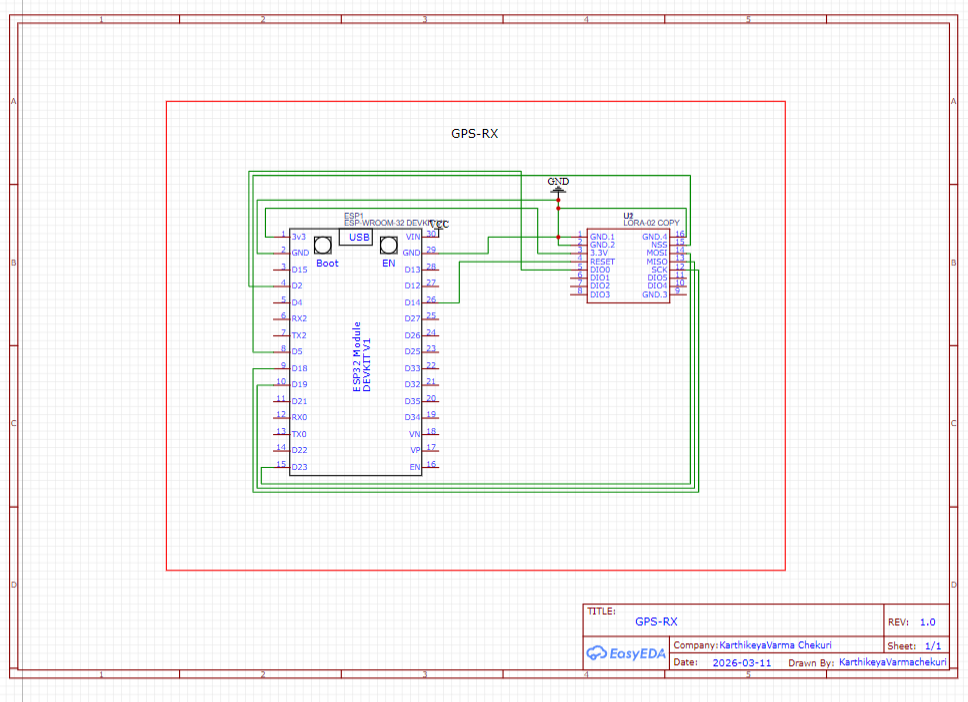
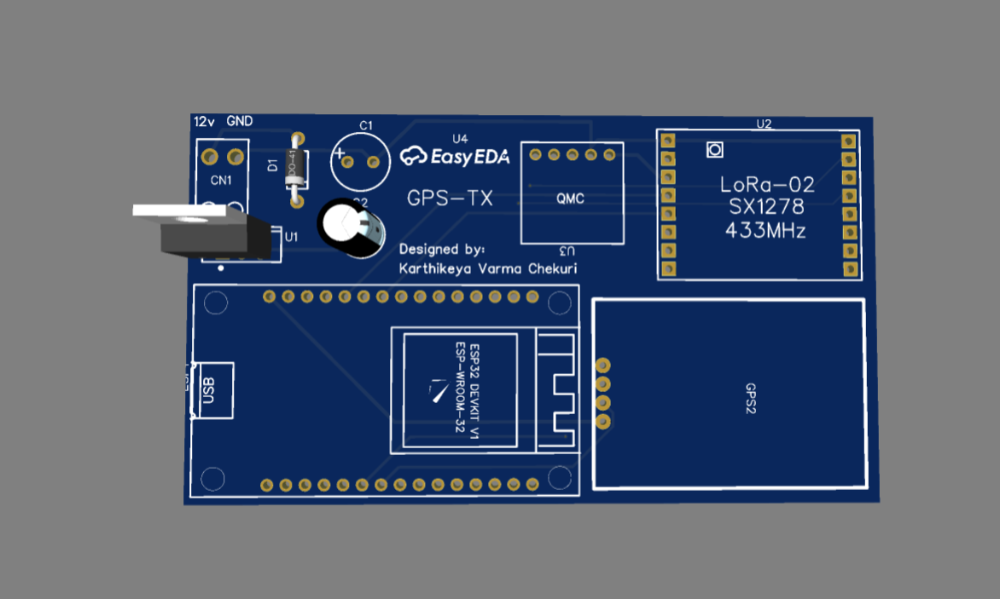
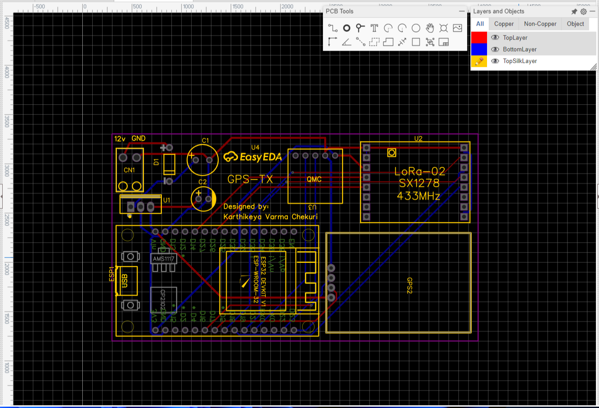
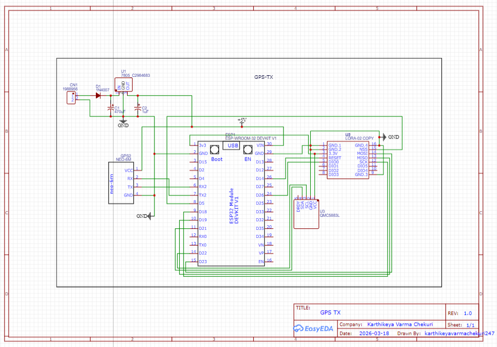

# ESP-32 LoRa GPS Tracker

Real-time GPS tracking system using ESP-32 and LoRa communication
with a Python backend and React web dashboard.

## Hardware Photos

### GPS Receiver

### GPS Transmitter

## Project Structure
- `GPS_Tracker/` — Arduino firmware for the transmitter
- `GPS_Receiver/` — Arduino firmware for the receiver
- `serial_reader/` — Python script to read serial GPS data
- `backend/` — Python FastAPI server
- `frontend/` — React + Vite web dashboard
- `database/` — SQLite database init script
- `pcb/` — PCB and schematic design files (EasyEDA)
- `images/` — Hardware and PCB design photos

## Requirements
- ESP-32 board
- LoRa module (Ra-02 SX1278 433MHz)
- NEO-6M GPS module
- Python 3.x
- Node.js

## Backend Setup
    cd backend
    pip install -r requirements.txt
    python main.py

## Frontend Setup
    cd frontend
    npm install
    npm run dev